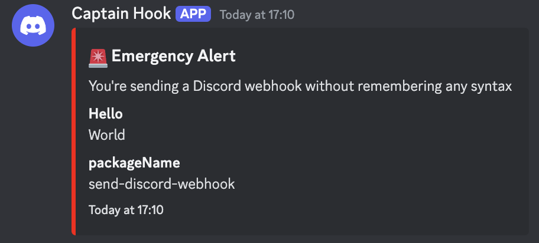

# Send Discord Webhook

Lightweight support for sending Discord webhooks without remembering syntax

```js
import { sendDiscordWebhook } from "send-discord-webhook";

await sendDiscordWebhook({
  title: "🚨 Emergency Alert",
  description: `You're sending a Discord webhook without remembering any syntax`,
  fields: [
    {
      name: "Hello",
      value: "World",
    },
    {
      name: "packageName",
      value: "send-discord-webhook",
    },
  ],
});
```

Result:


